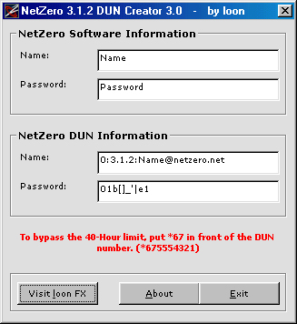



## NetZero 3\.1\.2 DUN Creator 3\.0 \(UPDATED\)

### Description

This program creates the correct username and password to sign onto NetZero without the software. When creating the NetZero DUN Account, make sure you use the access number from the NetZero software or if you already have one saved use that one as the number. Sign on and enjoy the net :) (Updated on how to bypass 40-Hour limit)
 
### More Info
 
When creating a new DUN you should use the information from the NetZero 3.1.2 DUN Creator 2.3 and use an access number from the netzero software. That's about it - you should know the rest.

             |
---                |---
**Submitted On**   |2001-03-31 13:29:10
**By**             |[loon](https://github.com/Planet-Source-Code/PSCIndex/blob/master/ByAuthor/loon.md)
**Level**          |Intermediate
**User Rating**    |5.0 (10 globes from 2 users)
**Compatibility**  |VB 6\.0
**Category**       |[Miscellaneous](https://github.com/Planet-Source-Code/PSCIndex/blob/master/ByCategory/miscellaneous__1-1.md)
**World**          |[Visual Basic](https://github.com/Planet-Source-Code/PSCIndex/blob/master/ByWorld/visual-basic.md)
**Archive File**   |[NetZero 3\.177563312001\.zip](https://github.com/Planet-Source-Code/loon-netzero-3-1-2-dun-creator-3-0-updated__1-15204/archive/master.zip)

